```mermaid
flowchart TD
    subgraph IN["INPUT"]
        direction LR
        Q["User Question / natural language"]
        SRC["Source Parameter / path/to/folder / postgresql://host/db / folder|postgresql://"]
        CFG["Config / chunk_size=2000 / chunk_overlap=300 / top_k=8 / threshold=0.2 / embedding model / Gemini API key"]
    end

    SD["SourceDetector.detect / contains pipe=HYBRID / postgresql://=POSTGRES / path=FOLDER"]

    subgraph AD["ADAPTER LAYER -- SourceFactory.create"]
        direction LR
        FA["FolderSourceAdapter / rglob recursive / max_depth + exclude_patterns / .pdf via pypdf / .txt .md .log via read_text / .docx disabled / returns List-RawDocument"]
        PA["PostgreSQLAdapter / SQLAlchemy engine / pool_pre_ping=True / pg_tables mode / 8 BOND_SYS tables / SELECT * LIMIT 1000 / DataFrame via _df_to_text / returns List-RawDocument"]
        MA["MultiSourceAdapter / composite adapter / iterates Folder+PostgreSQL / merges all docs / returns List-RawDocument"]
    end

    RD["List-RawDocument / content: full extracted text / source: file path or table name / doc_type: pdf txt md db_table / metadata: pages rows cols"]

    SP["UniversalTextSplitter / RecursiveCharacterTextSplitter / chunk_size=2000 / chunk_overlap=300 / separators: blank-line newline period space / returns List-LCDocument"]

    EM["EmbeddingModel singleton / paraphrase-multilingual-MiniLM-L12-v2 / device=CPU normalize=True / output dim=384 / chunk text to 384-dim vector"]

    FI["RuntimeIndexBuilder / FAISS.from_documents in-memory / no disk write / session cache by source key / same source: skip re-index"]

    QP["QueryProcessor.retrieve / embed question to 384-dim vector / similarity_search k=top_k*2=16 / score=1 div 1+L2dist / filter below 0.2 / sort desc keep top_k=8 / build_context for LLM"]

    GEN["AnswerGenerator.generate / Gemini 2.5-flash / temperature=0.3 max_tokens=2048 / zero-shot Indonesian prompt / 429=exponential backoff 15s / 503=backoff+fallback / attempt2=gemini-2.0-flash / attempt4=gemini-1.5-flash / max_retries=6"]

    subgraph EV["EVALUATOR -- 8 Quantitative Metrics"]
        direction LR
        M1["Retrieval Relevance RR / cos-sim Q vs chunks"]
        M2["Answer Faithfulness AF / F1 token ans vs ctx"]
        M3["Answer Completeness AC / keyword overlap Q to ans"]
        M4["ROUGE-L / LCS ans vs ref or ctx"]
        M5["BLEU-1 / unigram precision ans vs ref"]
        M6["Precision at K / chunks above thr div total K"]
        M7["MRR / reciprocal rank of best chunk"]
        M8["Context Coverage CC / unique source diversity"]
    end

    OUT["RAGResult / answer: generated text / retrieved_chunks: score source doc_type / timing: load split index retrieve generate / metadata: source_type raw_docs total_chunks llm / EvalResult: 8 scores 0-1 scale"]

    SRC --> SD
    Q --> SD
    SD -->|"SourceType.FOLDER"| FA
    SD -->|"SourceType.POSTGRES"| PA
    SD -->|"SourceType.HYBRID"| MA
    FA --> RD
    PA --> RD
    MA --> RD
    CFG -.->|"chunk_size/overlap"| SP
    CFG -.->|"embedding model"| EM
    CFG -.->|"top_k/threshold"| QP
    CFG -.->|"model/api_key"| GEN
    RD --> SP
    SP -->|"List-LCDocument"| EM
    EM -->|"384-dim vectors"| FI
    FI -->|"FAISS vectorstore"| QP
    Q -->|"embed question"| QP
    QP -->|"context string"| GEN
    GEN -->|"answer"| OUT
    QP -.->|"chunks+scores"| EV
    GEN -.->|"answer"| EV
    EV --> OUT

    style IN  fill:#EBF5FB,stroke:#2980B9,color:#000
    style Q   fill:#D6EAF8,stroke:#2980B9,color:#000
    style SRC fill:#D6EAF8,stroke:#2980B9,color:#000
    style CFG fill:#D6EAF8,stroke:#2980B9,color:#000
    style SD  fill:#D5F5E3,stroke:#27AE60,color:#000
    style AD  fill:#FEF9E7,stroke:#F39C12,color:#000
    style FA  fill:#FEF9E7,stroke:#F39C12,color:#000
    style PA  fill:#FEF9E7,stroke:#E67E22,color:#000
    style MA  fill:#FDEBD0,stroke:#E67E22,color:#000
    style RD  fill:#F9F9F9,stroke:#95A5A6,color:#000
    style SP  fill:#E8DAEF,stroke:#8E44AD,color:#000
    style EM  fill:#D7BDE2,stroke:#6C3483,color:#000
    style FI  fill:#D7BDE2,stroke:#6C3483,color:#000
    style QP  fill:#E8DAEF,stroke:#8E44AD,color:#000
    style GEN fill:#FADBD8,stroke:#E74C3C,color:#000
    style EV  fill:#EBF5FB,stroke:#2E86C1,color:#000
    style M1  fill:#D6EAF8,stroke:#2E86C1,color:#000
    style M2  fill:#D6EAF8,stroke:#2E86C1,color:#000
    style M3  fill:#D6EAF8,stroke:#2E86C1,color:#000
    style M4  fill:#D6EAF8,stroke:#2E86C1,color:#000
    style M5  fill:#D6EAF8,stroke:#2E86C1,color:#000
    style M6  fill:#D6EAF8,stroke:#2E86C1,color:#000
    style M7  fill:#D6EAF8,stroke:#2E86C1,color:#000
    style M8  fill:#D6EAF8,stroke:#2E86C1,color:#000
    style OUT fill:#D5F5E3,stroke:#1ABC9C,color:#000
```

# Figure 1 -- End-to-End Architecture: Agnostic Multi-Source RAG System

> Render: https://mermaid.live -- paste block -- Export PNG >= 300 DPI
> CLI: mmdc -i GAMBAR_1_ARSITEKTUR.md -o figure1.png -w 1800 -b white

---



---

## Official Caption (English -- for paper submission)

> **Figure 1.** End-to-end architecture of the Agnostic Multi-Source RAG System. The SourceDetector automatically classifies the input source parameter into one of three types (Folder, PostgreSQL, or Hybrid) and delegates document loading to the corresponding adapter via SourceFactory. Raw documents are split into 2000-character chunks with 300-character overlap using RecursiveCharacterTextSplitter, then encoded by a multilingual MiniLM model (384 dimensions) into a FAISS in-memory vector store. At query time, QueryProcessor embeds the user question, retrieves the top-8 most similar chunks (similarity threshold 0.2), and passes a formatted context string to AnswerGenerator, which invokes Gemini 2.5-flash with zero-shot prompting and an automatic retry/model-fallback chain. The final RAGResult is simultaneously scored by eight quantitative metrics: Retrieval Relevance (RR), Answer Faithfulness (AF), Answer Completeness (AC), ROUGE-L, BLEU-1, Precision@K, MRR, and Context Coverage (CC).

---

## Render to PNG (PowerShell)

```powershell
npm install -g @mermaid-js/mermaid-cli
mmdc -i GAMBAR_1_ARSITEKTUR.md -o figure1.png -w 1800 -b white
```

---

## Clean Flow Diagram (journal-ready)

```mermaid
flowchart TD

    L1(["Load Documents"])

    subgraph SRC_ROW["Adapters auto-selected by SourceDetector"]
        direction LR
        A1>"FolderSourceAdapter PDF TXT MD LOG"]
        A2>"PostgreSQLAdapter 8 BOND_SYS tables"]
        A3>"MultiSourceAdapter Folder + PostgreSQL"]
    end

    DET[["SourceDetector auto-classifies source string FOLDER / POSTGRES / HYBRID"]]

    L2(["Index Documents"])

    subgraph IDX_ROW["Indexing Pipeline"]
        direction LR
        B1>"RecursiveCharacterTextSplitter chunk 2000 chars overlap 300"]
        B2>"EmbeddingModel MiniLM 384-dim multilingual CPU"]
        B3>"RuntimeIndexBuilder FAISS in-memory session cache"]
    end

    L3(["Retrieve and Generate"])

    subgraph RET_ROW["RAG Core"]
        direction LR
        C1>"QueryProcessor embed Q top-8 chunks threshold 0.2"]
        C2>"AnswerGenerator Gemini 2.5-flash zero-shot retry fallback chain"]
    end

    L4(["Evaluate Answer"])

    subgraph EVA_ROW["8 Quantitative Metrics"]
        direction LR
        D1>"RR Retrieval Relevance"]
        D2>"AF Answer Faithfulness"]
        D3>"AC Answer Completeness"]
        D4>"ROUGE-L LCS Overlap"]
        D5>"BLEU-1 Unigram Precision"]
        D6>"P@K Precision at K"]
        D7>"MRR Mean Reciprocal Rank"]
        D8>"CC Context Coverage"]
    end

    OUT[["RAGResult answer + retrieved chunks + timing + 8 metric scores 0-1 scale"]]

    L1 --> SRC_ROW
    SRC_ROW --> DET
    DET --> L2
    L2 --> IDX_ROW
    IDX_ROW --> L3
    L3 --> RET_ROW
    RET_ROW --> L4
    L4 --> EVA_ROW
    EVA_ROW --> OUT

    style L1  fill:#F2F3F4,stroke:#AAB7B8,color:#000
    style L2  fill:#F2F3F4,stroke:#AAB7B8,color:#000
    style L3  fill:#F2F3F4,stroke:#AAB7B8,color:#000
    style L4  fill:#F2F3F4,stroke:#AAB7B8,color:#000
    style SRC_ROW fill:#FEF9E7,stroke:#F39C12,color:#000
    style IDX_ROW fill:#F4ECF7,stroke:#8E44AD,color:#000
    style RET_ROW fill:#FDEDEC,stroke:#E74C3C,color:#000
    style EVA_ROW fill:#EBF5FB,stroke:#2980B9,color:#000
    style A1  fill:#F9E79F,stroke:#D4AC0D,color:#000
    style A2  fill:#FAD7A0,stroke:#CA6F1E,color:#000
    style A3  fill:#FDEBD0,stroke:#CA6F1E,color:#000
    style B1  fill:#D7BDE2,stroke:#7D3C98,color:#000
    style B2  fill:#C39BD3,stroke:#6C3483,color:#000
    style B3  fill:#BB8FCE,stroke:#6C3483,color:#000
    style C1  fill:#F5B7B1,stroke:#CB4335,color:#000
    style C2  fill:#F1948A,stroke:#CB4335,color:#000
    style D1  fill:#AED6F1,stroke:#1F618D,color:#000
    style D2  fill:#AED6F1,stroke:#1F618D,color:#000
    style D3  fill:#AED6F1,stroke:#1F618D,color:#000
    style D4  fill:#A9CCE3,stroke:#1F618D,color:#000
    style D5  fill:#A9CCE3,stroke:#1F618D,color:#000
    style D6  fill:#A9CCE3,stroke:#1F618D,color:#000
    style D7  fill:#A9CCE3,stroke:#1F618D,color:#000
    style D8  fill:#A9CCE3,stroke:#1F618D,color:#000
    style DET fill:#D5F5E3,stroke:#1E8449,color:#000
    style OUT fill:#D5F5E3,stroke:#1ABC9C,color:#000
```


